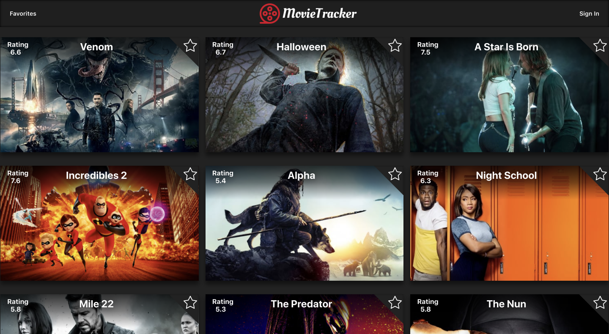
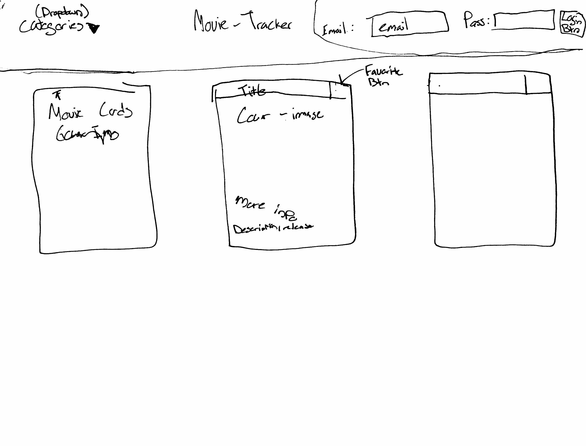

# Movie Tracker:
Movie Tracker is an application designed to allow users to view information about movies currently playing. It utilizes the Movie Database API to collect movie data, and is built primarily using React.js and Redux.

## Deployed App
[https://movie-tracker.netlify.com](https://movie-tracker.netlify.com/)

## Getting Started
This is a general guide to setting up a Recharge API development environment on your local machine.

### Dependencies
* React.js
* Redux
* React Router
* CSS3 
* Jest and Enzyme for testing
* See package.json for a list of required modules


### Developers:
#### Get the app on your local machine
* Fork this repo using the `Fork` button in the upper right corner of this page.

* `Clone` your fork onto your local machine
```
git clone https://github.com/YOUR_GITHUB_USERNAME_HERE/movie-tracker
```

* Jump into that directory on your local machine
```
cd movie-tracker
```

* Add an upstream remote that points to the main repo:
```
git remote add upstream https://github.com/alexanderela/movie-tracker.git
```

* Fetch the latest version of `master` from `upstream`
```
git fetch upstream master
```


#### Install and Start Server

* `npm install` all dependencies.

* `npm start` the development server.


### Contributing
This guide assumes that the git remote name of the main repo is `upstream` and that **your** fork is named `origin`.

Create a new branch on your local machine to make your changes against (based on `upstream/master`):
```
git checkout -b branch-name-here --no-track upstream/master
```
We recommend naming your branch using the following convention:
```
#(issueNumber)-feature-name-your-name
ex: 36-middleware-error-handling-alex
```

#### Contribute using GitHub Issues
* Click on the `Issues` tab at the top left of this page
* Choose one and work on your local machine to fix it  
  - We recommend naming your branch according to the above convention  
  - Use TDD as much as possible 
  - Once the tests are passing, you can commit your changes. See [Making a great commit for more tips](https://github.com/openfoodfoundation/openfoodnetwork/wiki/Making-a-great-commit).  
```
git add .
git commit -m "Add a concise commit message describing your change here"
```
  - Before pushing to your fork, rebase your commits against the upstream master branch
```
git pull --rebase upstream master
```
  - Push your changes to a branch on your fork:
```
git push origin branch-name-here
```

#### Submitting a Pull Request
* Create a Pull Request (PR) to this repo's master using GitHub's UI
* Fill in the requested information re: what you worked on
* Keep your PR small, with a single focus


## Technologies Used
- React.js
- Redux
- React Router
- CSS3 
- Jest and Enzyme for testing

This project was bootstrapped with [Create React App](https://github.com/facebook/create-react-app).

## Project Requirements
Project spec can be found [here](https://github.com/turingschool-examples/movie-tracker).

## This is a group project designed and coded by:
* Drake Bott - [Github.com/bottd](https://github.com/bottd)
* Alex Bruce - [Github.com/Alexbruce1](https://github.com/Alexbruce1)
* Alexander Ela - [Github.com/alexanderela](https://github.com/alexanderela)

## Images:
### Home Page


### Wireframe


## This README relied upon Open Food Source's extensive and excellent [Set Up](https://github.com/openfoodfoundation/openfoodnetwork/blob/master/GETTING_STARTED.md) and [Contibution](https://github.com/openfoodfoundation/openfoodnetwork/blob/master/CONTRIBUTING.md) docs.
